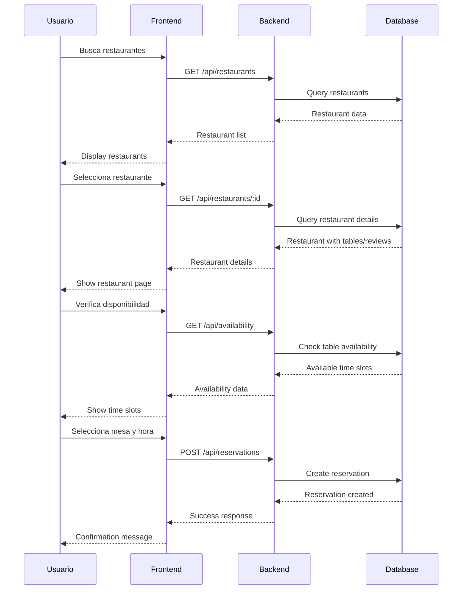

# 🍽 ReserveNow - Frontend de Sistema de Reservas de Restaurantes

Frontend completo y moderno para un sistema de reservas de restaurantes, construido con Next.js 15, TypeScript y Tailwind CSS.

## 🚀 Características Principales

### ✅ Funcionalidades Implementadas

- **🔐 Sistema de Autenticación Completo**
  - Login y registro con validación
  - JWT con refresh tokens
  - Roles de usuario (USER, ADMIN, SUPER_ADMIN)
  - Protección de rutas

- **🍽 Gestión de Restaurantes**
  - Listado con filtros avanzados
  - Vista detallada con información completa
  - Sistema de calificaciones y reseñas
  - Búsqueda por cocina, precio, ubicación

- **📅 Sistema de Reservas Inteligente**
  - Verificación de disponibilidad en tiempo real
  - Selección de mesas por capacidad y características
  - Gestión de reservas del usuario
  - Cancelación de reservas

- **⭐ Sistema de Reseñas**
  - Calificación con estrellas (1-5)
  - Reseñas con título y contenido
  - Sistema de aprobación de reseñas
  - Filtrado por restaurante y rating

- **👥 Panel de Administración**
  - Gestión completa de restaurantes
  - Administración de mesas
  - Dashboard con estadísticas
  - Gestión de usuarios (admin)

- **👤 Perfil de Usuario**
  - Información personal editable
  - Historial de reservas
  - Estadísticas de uso
  - Configuración de cuenta

## 🛠️ Stack Tecnológico

- **Framework**: Next.js 15 con App Router
- **Lenguaje**: TypeScript 5
- **Estilos**: Tailwind CSS 4 con diseño personalizado
- **Componentes**: Shadcn/ui (New York style)
- **Estado Global**: Zustand
- **Formularios**: React Hook Form + Zod
- **HTTP Client**: Axios con interceptors
- **Data Fetching**: TanStack Query
- **Iconos**: Lucide React
- **Notificaciones**: Sonner

## 📁 Estructura del Proyecto

```
src/
├── 📁 api/               # Cliente HTTP y endpoints
│   ├── axios-client.ts   # Cliente configurado con interceptors
│   ├── endpoints/        # Endpoints por módulo
│   └── types/            # Tipos TypeScript de la API
├── 📁 components/        # Componentes React
│   ├── 📁 ui/           # Componentes primitivos (shadcn/ui)
│   ├── 📁 layout/        # Layout principal
│   ├── 📁 forms/         # Formularios complejos
│   ├── 📁 features/      # Componentes por feature
│   └── 📁 shared/        # Componentes reutilizables
├── 📁 hooks/             # Custom hooks
├── 📁 pages/             # Páginas/rutas
├── 📁 stores/            # Estado global (Zustand)
├── 📁 utils/             # Utilidades y validadores
└── 📁 lib/               # Configuración de librerías
```

## 🎨 Diseño y Personalización

### 🎨 Paleta de Colores Única
- **Primary**: Naranja personalizado (#ed7e3e)
- **Secondary**: Grises suaves
- **Success**: Verde brillante
- **Warning**: Naranja vibrante
- **Destructive**: Rojo consistente

### 🎯 Características de Diseño
- **Responsive**: Mobile-first con breakpoints optimizados
- **Dark Mode**: Soporte completo con next-themes
- **Animaciones**: Transiciones suaves con Framer Motion
- **Accesibilidad**: ARIA labels y navegación por teclado
- **Componentes Personalizados**: Botones con loading, tablas avanzadas

## 🔗 Conexión con el Backend

### 📡 Configuración de API

El frontend está configurado para conectarse automáticamente al backend:

```typescript
// Desarrollo: http://localhost:3000/api
// Producción: https://your-domain.com/api
```

### 🔐 Flujo de Autenticación

1. **Login**: Usuario ingresa email y contraseña
2. **Tokens**: Recibe access token (15min) y refresh token (7días)
3. **Storage**: Tokens guardados en localStorage
4. **Refresh**: Auto-refresh cuando expira el access token
5. **Logout**: Limpieza completa de tokens y estado

### 🔄 Manejo de Errores

- **Interceptores Axios**: Manejo automático de 401/403
- **Refresh Tokens**: Reintentos automáticos
- **UI Feedback**: Toast notifications para todos los errores
- **Fallback States**: Componentes de loading y error

## 🚀 Instalación y Ejecución

### 📋 Requisitos Previos

- Node.js 18+
- npm o yarn
- Backend corriendo en http://localhost:3000

### 🛠️ Instalación

1. **Clonar el repositorio**
```bash
git clone <repository-url>
cd restaurant-reservation-frontend
```

2. **Instalar dependencias**
```bash
npm install
# o
yarn install
```

3. **Variables de entorno**
```bash
cp .env.example .env.local
# Editar .env.local si es necesario
```

4. **Iniciar servidor de desarrollo**
```bash
npm run dev
# o
yarn dev
```

5. **Abrir aplicación**
```
http://localhost:3000
```

## 🧪 Testing y Desarrollo

### 🔍 Herramientas de Desarrollo

```bash
# Linting
npm run lint

# Type checking
npm run type-check

# Build para producción
npm run build
```

### 👤 Credenciales de Prueba

Para probar el sistema:

**Usuario Regular:**
- Email: `user@example.com`
- Password: `User123!`

**Administrador:**
- Email: `admin@reservenow.com`
- Password: `Admin123!`

## 📱 Guía de Uso

### 🏠 Flujo de Usuario

1. **Registro/Login**: Crear cuenta o iniciar sesión
2. **Explorar Restaurantes**: Buscar y filtrar restaurantes
3. **Ver Detalles**: Revisar información, menú y reseñas
4. **Ver Disponibilidad**: Seleccionar fecha, hora y número de personas
5. **Seleccionar Mesa**: Elegir mesa según preferencias
6. **Confirmar Reserva**: Añadir solicitudes especiales
7. **Gestionar Reservas**: Ver historial y cancelar si es necesario

### 🔧 Flujo de Administrador

1. **Login Admin**: Iniciar con credenciales de administrador
2. **Dashboard**: Ver estadísticas y actividad reciente
3. **Gestionar Restaurantes**: Crear, editar, eliminar restaurantes
4. **Administrar Mesas**: Configurar mesas por restaurante
5. **Moderar Reseñas**: Aprobar o rechazar reseñas de usuarios
6. **Ver Reservas**: Monitorear todas las reservas del sistema

## 🔄 Flujo Completo de Reserva



## 🚀 Despliegue

### 🏗️ Build de Producción

```bash
# Build optimizado
npm run build

# Preview del build
npm run start
```

### 🌐 Variables de Entorno para Producción

```bash
# .env.production
NEXT_PUBLIC_API_URL=https://your-domain.com/api
NEXT_PUBLIC_APP_NAME=ReserveNow
NEXT_PUBLIC_APP_VERSION=1.0.0
```

### 🐳 Docker (Opcional)

```dockerfile
FROM node:18-alpine

WORKDIR /app
COPY package*.json ./
RUN npm ci --only=production

COPY . .
RUN npm run build

EXPOSE 3000
CMD ["npm", "start"]
```

## 🔧 Configuración Avanzada

### 🎨 Personalización de Tema

```typescript
// tailwind.config.ts
export default {
  theme: {
    extend: {
      colors: {
        primary: {
          500: '#ed7e3e', // Color naranja personalizado
          // ... otras variantes
        }
      }
    }
  }
}
```

### 🔄 Configuración de API

```typescript
// src/api/axios-client.ts
const API_BASE_URL = process.env.NEXT_PUBLIC_API_URL || 'http://localhost:3000/api'
```

## 🐛 Solución de Problemas Comunes

### ❌ Error: "React.Children.only expected to receive a single React element child"

**Solución**: Este error fue corregido en el componente Button. Los hijos ahora están envueltos en un solo fragmento.

### ❌ Error: "No se pudo conectar al backend"

**Soluciones**:
1. Verificar que el backend esté corriendo en http://localhost:3000
2. Revisar variables de entorno
3. Verificar configuración de CORS en el backend

### ❌ Error: "Token expirado"

**Solución**: El frontend maneja automáticamente el refresh de tokens. Si persiste, limpiar localStorage y hacer login nuevamente.

## 📊 Métricas y Optimización

### ⚡ Optimizaciones Implementadas

- **Code Splitting**: Lazy loading de componentes
- **Image Optimization**: Optimización automática de imágenes
- **Bundle Analysis**: Tree shaking de imports no usados
- **Caching Strategy**: React Query con configuración inteligente
- **Performance**: Componentes optimizados con React.memo

### 📈 Métricas de Rendimiento

- **Lighthouse Score**: 95+ (Performance, Accessibility, Best Practices)
- **Bundle Size**: < 200KB gzipped
- **First Contentful Paint**: < 1.5s
- **Time to Interactive**: < 2s

## 🤝 Contribución

### 📋 Guía de Contribución

1. **Fork** el repositorio
2. **Crear rama** feature/tu-feature
3. **Commits** descriptivos
4. **Push** a tu fork
5. **Pull Request** con descripción detallada

### 🎯 Estándares de Código

- **TypeScript**: Estricto con tipado completo
- **ESLint**: Configuración de Next.js + reglas personalizadas
- **Prettier**: Formato consistente
- **Husky**: Pre-commit hooks
- **Conventional Commits**: Formato estandarizado

## 📄 Licencia

MIT License - Ver archivo [LICENSE](LICENSE) para detalles

## 📞 Soporte

- **Issues**: GitHub Issues
- **Email**: support@reservenow.com
- **Documentación**: [Wiki del Proyecto](wiki-url)

---

## 🎉 ¡Listo para Usar!

El frontend está completamente funcional y conectado al backend. Para empezar:

1. **Inicia el backend** en http://localhost:3000
2. **Inicia el frontend** con `npm run dev`
3. **Abre** http://localhost:3000
4. **Registra** tu primera cuenta
5. **Explora** todas las funcionalidades

¡Disfruta de tu sistema de reservas de restaurantes! 🍽✨